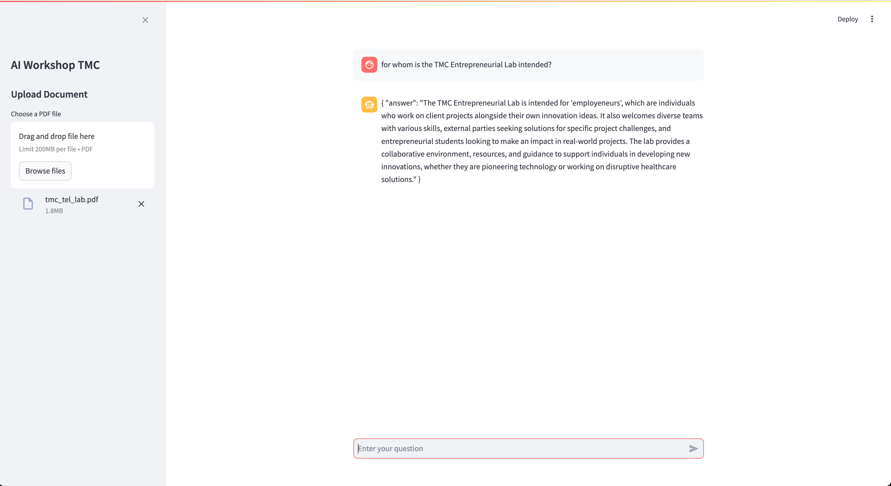
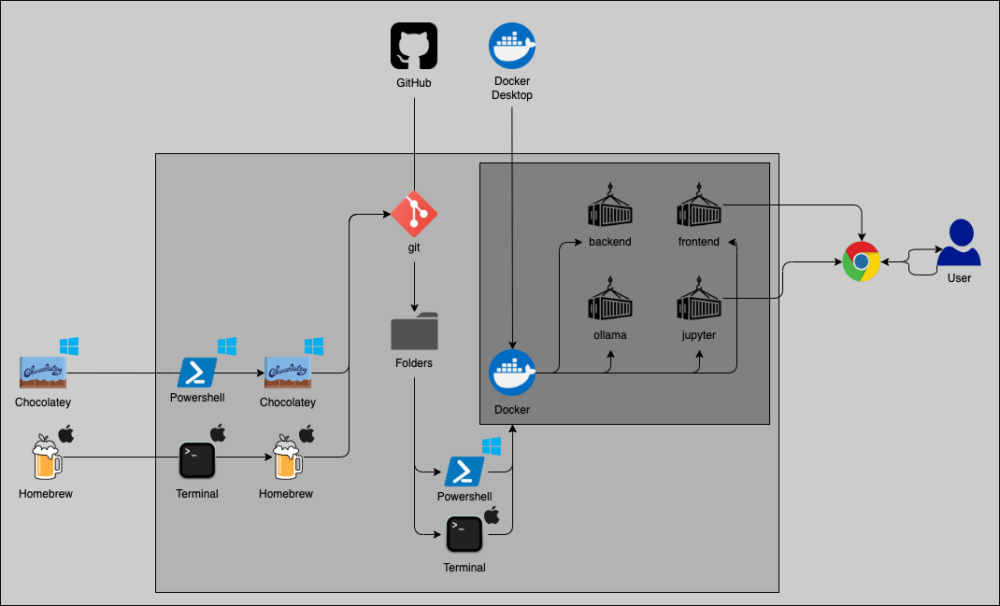
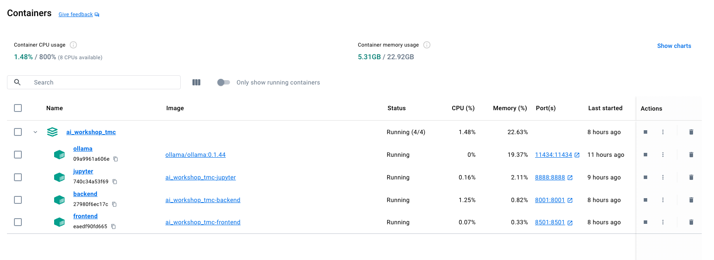

<!-- #remove -->
<link rel="stylesheet" href="dist/reset.css">
<link rel="stylesheet" href="dist/reveal.css">
<link rel="stylesheet" href="dist/theme/night.css" id="theme">
<link rel="stylesheet" href="plugin/highlight/monokai.css">
<!-- #remove -->

# ai_workshop_tmc

Welcome to the repository for TMC's exclusive AI Workshop on programming your private AI assistant. This repository contains all resources and instructions needed to set up and build a simple ChatGPT-like AI assistant on your laptop, ensuring privacy and customization possibilities.

## Inspiration

> "Success in creating AI would be the biggest event in human history. Unfortunately, it might also be the last, unless we learn how to avoid the risks." – Stephen Hawking

## AI Workshop TMC - Application Screenshot



## Features

**Document Upload**
- Users can upload a PDF document through the sidebar.
- The uploaded document is sent to the backend service for processing.
- The app displays the result of the document upload in the sidebar.

**Chat Interface**
- The main interface includes a chat window where users can interact with the AI assistant.
- Users can enter their questions in the chat input field.
- The chat history is preserved across interactions, displaying both user questions and assistant responses.

**Backend Queries**
- The app can query the backend service in two ways:
  - **Query with Document Context**: If a document has been uploaded, the app queries the backend with the context of the uploaded document.
  - **Direct Query**: If no document is uploaded, the app sends a direct query to the backend.
- The assistant's responses are displayed in the chat window.

## Part 1: Setup & Tools

### Learning Objectives - Part 1: Tools & Setup

1. **Complete Installation of Essential Tools**
2. **Understand Functioning of Essential Tools**
3. Understand the Basics of Large Language Models (LLMs)
4. Understand on a Programmatic Level how AI Assistants are Built

### Agenda

- Important Links
- Pre-Questionnaire
- Installation Overview
- Tool Installation Loop (HandsOn)
  - Explanation
  - Context
  - Installation
  - Testing

### Important Links

- [Part 1 — Tools and Setup](https://docs.google.com/document/d/1VBoqt0QMgo-nvunoCdDdD1aMDdvsJwMbeUCtCBvnafg/edit?usp=sharing): Google Docs document for commenting on personal progress/ follow along.
- [Part 2 — Building the AI Assistant](https://docs.google.com/document/d/1wd7lMZLeqzZ0OAmXqU6g8J3vb93XCC1GTVvxjiECNRQ/edit?usp=sharing): Google Docs document for commenting on personal progress/ follow along.
- [GitHub Page](https://github.com/marioisbeck/ai_workshop_tmc) with all code and information

### Pre-Questionnaire


- This helps us determine the main installation prerequisites for troubleshooting.
- [Link to Pre-Questionnaire](https://forms.office.com/Pages/ResponsePage.aspx?id=wNeaMZcqWEaYX4P3x9gUAs2qiOLRl25Dj3tOiV0_PtNURFgxN0hEWU9WMzZUQjRVUFNKUkY1V0M2OS4u)

### Installation Overview



### Tools for Installation

- Command Line Interfaces (CLIs)
  - Terminal
  - Powershell
- Package Managers
  - Mac: [Homebrew](https://brew.sh/)
  - Windows: [Chocolatey](https://chocolatey.org/)
- [Git](https://git-scm.com/downloads)
- [Docker Desktop](https://www.docker.com/products/docker-desktop/)
- Containers
- Ollama

### Tools for Development

- [VSCode](https://code.visualstudio.com/download)
  - [Cody](https://sourcegraph.com/docs/cody/clients/install-vscode)
  - [Docker](https://code.visualstudio.com/docs/containers/overview)
- [GitHub](https://github.com/)
- [Jupyter](https://jupyter.org/)
- [Python](https://www.python.org/)
  - [Langchain](https://github.com/langchain-ai/langchain)
  - [Langserve](https://github.com/langchain-ai/langserve)/ [FastAPI](https://github.com/tiangolo/fastapi)
  - [Streamlit](https://github.com/streamlit/streamlit)

### Tool Installation Loop

- Explanation
- Context
- Installation
- Testing

#### Command Line Interfaces (CLIs)

**Explanation - CLIs**
- Text-based interface for interacting with the computer.
- Allows execution of commands by typing them.
- Essential for developers and system administrators.

**Context - CLIs**


**Installation - CLIs**
No installation needed. Every operating system comes with some native CLIs pre-installed.

**Testing - CLIs**
Open Terminal on a Mac and Powershell (in Administrator mode) on a Windows machine.

#### Package Managers

**Explanation - Package Managers**
- Simplifies the installation, update, and management of software packages.
- Automates the process of downloading and configuring software dependencies.
- Provides a centralized repository for easy access to a wide range of tools and applications.

**Context - Package Managers**


**Installation - Package Managers**
- **Mac/ Linux**
  - Follow the instructions at [Homebrew](https://brew.sh/)
  - Open *Terminal*
  - Run `/bin/bash -c "$(curl -fsSL https://raw.githubusercontent.com/Homebrew/install/HEAD/install.sh)"`
- **Windows**
  - Follow the instructions at [Chocolatey](https://chocolatey.org/install#individual).
  - Open *Powershell* or *CMD* as Administrator
  - Run `Set-ExecutionPolicy Bypass -Scope Process -Force; [System.Net.ServicePointManager]::SecurityProtocol = [System.Net.ServicePointManager]::SecurityProtocol -bor 3072; iex ((New-Object System.Net.WebClient).DownloadString('https://community.chocolatey.org/install.ps1'))`

**Testing - Package Managers**
- **Mac/ Linux**
  - Open *Terminal*
  - Run `brew --version`
- **Windows**
  - Open *Powershell* as Administrator
  - Run `choco --version`

#### Git
**Explanation - Git**
- Distributed version control system.
- Tracks changes in source code during software development.
- Facilitates collaboration among developers.

**Context - Git**


**Installation - Git**
- **Mac/ Linux**
  - Open *Terminal*
  - Run `cd ~` to set the path to your home directory
  - Install git with: `brew install git`
- **Windows**
  - Open *Powershell* as Administrator
    - Run `cd ~` to set the path to your home directory
    - Install git with: `choco install git`

**Testing - Git**
- **Mac/ Linux**
  - Open *Terminal*
  - Run `git --version`
- **Windows**
  - Open *Powershell* as Administrator
  - Run `git --version`

#### Docker Desktop

**Explanation - Docker**
- Platform for developing, shipping, and running applications in isolated environments called containers.
- Ensures consistency across multiple development, testing, and production environments.
- Facilitates microservices architecture by allowing applications to be broken down into smaller, manageable services.
- **Docker Desktop** provides a user-friendly interface for managing Docker containers.

**Context - Docker Desktop**


**Installation - Docker Desktop**
- **Mac/ Linux/ Windows**
  - Go to [Docker Desktop](https://www.docker.com/products/docker-desktop/) and select the appropriate installation medium.
  - Follow the instructions of the installation.

> Very likely a computer restart is required - please make sure that you have a second device in the MS Teams meeting so that you can continue to follow the instructions in the time your computer reboots.

**Testing - Docker Desktop**
- Open Docker Desktop

#### Containers

**Explanation - Containers**
- `frontend`: Hosts the Streamlit user interface for the AI Assistant application.
- `backend`: Hosts the Langserve/Langchain application via RESTful API to route incoming API calls to Ollama and back to the frontend.
- `ollama`: Hosts and serves the LLMs and Embedding Models.
- `jupyter`: Used for detailed explanation of how LLMs work and hands-on code walkthroughs.

**Context - Containers**


**Installation - Containers**

* Clone GitHub Repo
  ```bash
  # cd to your home directory
  cd ~
  # Clone the repository from the given URL
  git clone https://github.com/marioisbeck/ai_workshop_tmc.git
  # Change directory to the cloned repository
  cd ai_workshop_tmc
  ```
* Run Docker-Compose to Startup Containers
  ```bash
  # Copy the example environment file to a new .env file
  cp .env.example .env

  # Build and start the Docker containers in detached mode
  docker-compose up -d --build
  ```
* Download LLMs
  ```bash
  # Pull the mxbai-embed-large model in the ollama container
  docker exec ollama ollama pull mxbai-embed-large && \
  # Pull the all-minilm model in the ollama container
  docker exec ollama ollama pull all-minilm && \
  # Pull the wizardlm2:7b model in the ollama container
  docker exec ollama ollama pull wizardlm2:7b && \
  # Run the wizardlm2:7b model in the ollama container
  docker exec ollama ollama run wizardlm2:7b
  ```

**Testing - Containers**
* Open `Docker Desktop` and go to `Containers`. You should see something like this (all container icons should be green)
  
* Go to http://localhost:11434. The website should say: `Ollama is running`.

## Recap


1. **Complete Installation of Essential Tools**
2. **Understand Functioning of Essential Tools**
3. Understand the Basics of Large Language Models (LLMs)
4. Understand on a Programmatic Level how AI Assistants are Built

## Readiness Check

> It is likely that the computer is still downloading the images for the docker containers or LLMs for ollama. So be sure all the previous testing steps were completed successfully

1. Go to http://localhost:8501 and see if the AI Workshop TMC appplication interface is up and running.
2. Type a question and hit enter - this should work all locally and no internet is required!
3. Upload a pdf (<5 MB) and ask a question about the pdf.

## Part 2: Building the AI Assistant

Head over to http://localhost:8888 enter the password: `fewi2398u24@*@sd` and open the ai_workshop_tmc.ipynb file. The presentation we will go through is based on this file and all code walkthroughs are given in this file as well.

## Feedback


[Feedback](https://forms.office.com/e/CwRvint3LY?origin=lprLink)


## Appendix

### AI Workshop Admin Preparation Commands
* `pandoc README.md -o part1.docx --resource-path=/Users/mario/programming/ai_workshop_tmc`
* `pandoc ai_workshop_tmc.ipynb -o part2.docx --resource-path=/Users/mario/programming/ai_workshop_tmc`
